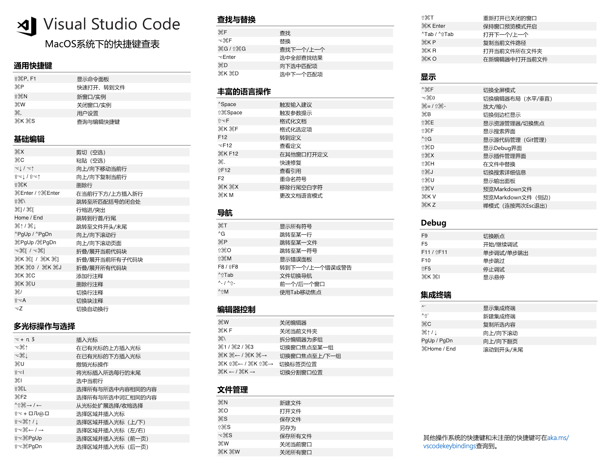

---
presentation:
  theme: solarized.css
  mouseWheel: true
  width: 1000
  height: 900
---
<!-- slide -->
# Markdown

# 制作幻灯片

## by 契卡
<!-- slide -->
# 目录

## 1. 环境准备

## 2. 基本语法

## 3. 代码实例

## 4. 结果输出
<!-- slide -->
### 环境准备

#### Visual Studio Code 编辑器安装


<!-- slide -->
### 环境准备

#### Markdown Preview Enhanced 扩展安装


<!-- slide -->
### 基本语法

#### Markdown 基本语法

```Markdown
# 一级标题
## 二级标题
### 三级标题
#### 四级标题
##### 五级标题
###### 六级标题
正文
```
<!-- slide -->
### 基本语法

#### Markdown 基本语法


<!-- slide -->
### 基本语法

#### Markdown 基本语法

```Markdown
#### 无序列表
- 1
- 2
- 3
* 1
* 2
* 3
#### 有序列表
1. 1
2. 2
3. 3
```
<!-- slide -->
### 基本语法

#### Markdown 基本语法


<!-- slide -->
### 基本语法

#### Markdown 基本语法

```Markdown
> 这里是引用
```
<!-- slide -->
### 基本语法

#### Markdown 基本语法


<!-- slide -->
### 基本语法

#### Markdown 基本语法

```Markdown
#### 插入链接
[Bing](/images/https://cn.bing.com)
#### 插入图片

```
<!-- slide -->
### 基本语

#### Markdown 基本语法


<!-- slide -->
### 基本语法

#### Markdown 基本语法

```Markdown
**这里是粗体**
*这里是斜体*
~~这里是删除线~~
```
<!-- slide -->
### 基本语法

#### Markdown 基本语法


<!-- slide -->
### 基本语法

#### Markdown 基本语法

```Markdown
#### 表格
| 实验组 | 时间  |   数量 |
| :----- | :---: | -----: |
| M1     |  1h   | 120000 |
| M2     |  2h   | 140000 |
| M3     |  3h   | 160000 |
```
<!-- slide -->
### 基本语法

#### Markdown 基本语法


<!-- slide -->
### 基本语法

#### Markdown 基本语法


<!-- slide -->
### 基本语法

#### Markdown 基本语法


<!-- slide -->
### 基本语法

#### Markdown 基本语法

```Markdown
#### 下面是分割线
***
#### 下面也是分割线
---
```
<!-- slide -->
### 基本语法

#### Markdown 基本语法


<!-- slide -->
### 基本语法

#### Markdown 基本语法

```Markdown
#### 块内公式

$$x=\frac{-b\pm\sqrt{b^2-4ac}}{2a}$$

#### 行内公式

$x=\frac{-b\pm\sqrt{b^2-4ac}}{2a}$
```
<!-- slide -->
### 基本语法

#### Markdown 基本语


<!-- slide -->
### 基本语法

#### MPE 幻灯片分割

```Markdown
<!-- slide -->
# Hi here
<!-- slide -->
let us go
<!-- slide -->
Thank you!
```
<!-- slide -->
### 基本语法

#### MPE 幻灯片分割


<!-- slide -->
### 代码实例

#### 就是本幻灯片
<!-- slide -->
### 结果输出


<!-- slide -->
# Thank you!

<style>
body {
  backgroud: #000;
}
</style>